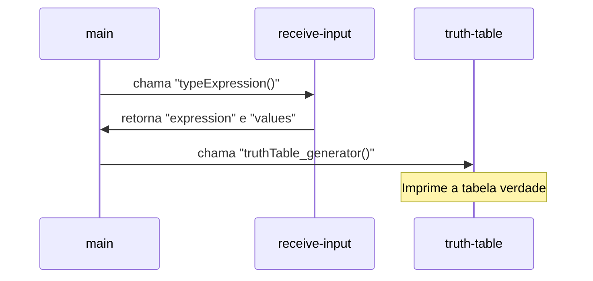
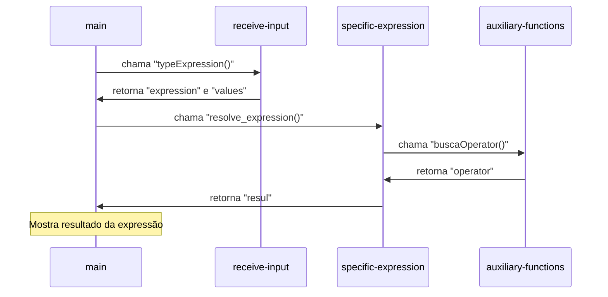

# Analise de Expressões Lógicas


## 📖 Descrição
Este projeto implementa um avaliador de expressões booleanas, permitindo a geração de tabelas-verdade e a avaliação de expressões com valores específicos. Ele foi criado com a intenção de ajudar os alunos que cursarão a disciplina de matemática discreta.

Este projeto foi desenvolvido utilizando **Python**.

---

## 📋 Índice
1. [Instalação](#-instalação)
2. [Funcionalidades](#-funcionalidades)
3. [Tecnologias](#-tecnologias)
4. [Exemplos](#-exemplos)
5. [Sobre o Autor](#-sobre-o-autor)

---

## 🛠 Instalação e execução

1. Clone o repositório:
    ```bash
    git clone https://github.com/gbrielmartinssreo/analise-expressoes-logicas.git
    ```
2. Navegue até o diretório do projeto:
    ```bash
    cd analise-expressoes-logicas
    ```
3. Certifique-se de ter o python instalado:
    ```python
    python --version
    ```

4. Rode o programa:
	```python
    python main.py
	```


---

## ⚙️ Funcionalidades

### Geração de Tabelas-Verdade
 Gera tabelas-verdade para expressões booleanas arbitrárias, visualizando os resultados para todas as combinações possíveis de valores das variáveis.
 
 **Diagrama sequencial**



### Avaliação de Expressões Específicas

Avalia expressões booleanas fornecendo valores específicos para as variáveis.  O avaliador retorna o resultado (Verdadeiro ou Falso).

* **Operadores Suportados:**  O avaliador suporta os seguintes operadores lógicos:
    * `^`: E (AND)
    * `v`: OU (OR)
    * `~`: NÃO (NOT)
    * `>`: Implicação
    * `-`: Bicondicional (equivalência)
    * `(` e `)`: Parênteses para controlar a precedência.
  



## 💻 Tecnologias
### Resolução de Expressões com o Algoritmo Shunting-Yard

Para a funcionalidade de resolver expressões lógicas com valores específicos, o projeto implementa o **Algoritmo Shunting-Yard**.

#### Notação Infixa e Lógica do Computador

Nós escrevemos expressões em **notação infixa**, onde os operadores ficam *entre* os operandos (ex: `P ^ Q > R`). Essa notação depende de regras de precedência (o `^` é resolvido antes do `>`) e do uso de parênteses para alterar essa ordem. Para um computador, percorrer e avaliar isso diretamente é complexo e ineficiente.

#### A Estratégia: Convertendo para Notação Pós-fixa (RPN)

A solução é traduzir a expressão infixa para um formato que o computador entende nativamente: a **notação pós-fixa** (ou Notação Polonesa Reversa - RPN). Nessa notação, o operador vem *depois* dos seus operandos.

-   A expressão infixa `(P ^ Q) > R`
-   Se torna a expressão pós-fixa `P Q ^ R >`

Neste formato, a expressão pode ser avaliada de forma linear e simples, usando uma pilha, sem a necessidade de se preocupar com a precedência.

#### O Motor: Como o Shunting-Yard Atua no Projeto

O algoritmo Shunting-Yard ("desvio de trilhos", em tradução livre) é o motor que faz essa conversão. Ele funciona de forma análoga a uma estação de triagem de trens:

1.  **A Expressão é Lida Token a Token:** `(`, `P`, `^`, `Q`, `)`, `>`, `R`.
2.  **Operandos (`P`, `Q`, `R`)**: São enviados diretamente para uma "fila" de saída final.
3.  **Operadores (`^`, `>`, `~`...)**: São colocados em uma "pilha" de espera. Um operador só pode entrar na pilha se ela estiver vazia ou se ele tiver maior precedência que o operador que já está no topo. Caso contrário, o operador do topo é movido para a fila de saída para garantir a ordem correta das operações.
4.  **Parênteses**: Funcionam como comandos de prioridade para descarregar os operadores da pilha na ordem certa.

Ao final do processo, a fila de saída contém a expressão perfeitamente ordenada em notação pós-fixa, pronta para ser avaliada de forma simples e eficiente pelo programa. Isso permite que expressões lógicas complexas com conjunções (`^`), disjunções (`v`), condicionais (`>`), etc., sejam interpretadas corretamente, respeitando todas as regras da lógica proposicional.

---
## 👨🏻‍⚖️ Exemplos

**Geração de Tabela-Verdade:**
```
Bem-vindo ao Solucionador de Lógica Proposicional!
Escolha uma das opções abaixo:
1. Gerar tabela verdade
2. Resolver expressão lógica com valores específicos
3. Resolver demonstrações com regras de inferência
4. Sair
Digite o número da opção desejada: 1
Quantas letras tem a expressao: 3
Digite a expressao: (A^B)vC
Digite a 1º letra: A
Digite a 2º letra: B
Digite a 3º letra: C
-------------------------------------
   A    |    B    |    C    | (A^B)vC
-------------------------------------
 False  |  False  |  False  |  False 
-------------------------------------
 False  |  False  |   True  |   True 
-------------------------------------
 False  |   True  |  False  |  False 
-------------------------------------
 False  |   True  |   True  |   True 
-------------------------------------
  True  |  False  |  False  |  False 
-------------------------------------
  True  |  False  |   True  |   True 
-------------------------------------
  True  |   True  |  False  |   True 
-------------------------------------
  True  |   True  |   True  |   True 
-------------------------------------

```    

**Resolvendo Expressão:**
```
Bem-vindo ao Solucionador de Lógica Proposicional!
Escolha uma das opções abaixo:
1. Gerar tabela verdade
2. Resolver expressão lógica com valores específicos
3. Resolver demonstrações com regras de inferência
4. Sair
Digite o número da opção desejada: 2
Quantas letras tem a expressao: 2
Digite a expressao: ~AvB
Digite a 1º letra: A
Digite o valor (V/F): F
Digite a 2º letra: B
Digite o valor (V/F): V
True

```

---

## 👤 Sobre o Autor

Este projeto foi criado por [Gabriel Martins de Morais](https://github.com/gbrielmartinssreo).

---
