# Analise de Expressões Lógicas


## 📖 Descrição
Este projeto implementa um avaliador de expressões booleanas, permitindo a geração de tabelas-verdade e a avaliação de expressões com valores específicos. Ele foi criado com a intenção de ajudar os alunos que cursarão a disciplina de matemática discreta.

Este projeto foi desenvolvido utilizando **Python**.

---

## 📋 Índice
1. [Instalação](#-instalação)
2. [Funcionalidades](#-funcionalidades)
3. [Tecnologias](#-tecnologias)
4. [Exemplos](#-exemplos)
5. [Sobre o Autor](#-sobre-o-autor)

---

## 🛠 Instalação e execução

1. Clone o repositório:
    ```bash
    git clone https://github.com/gbrielmartinssreo/analise-expressoes-logicas.git
    ```
2. Navegue até o diretório do projeto:
    ```bash
    cd analise-expressoes-logicas
    ```
3. Certifique-se de ter o python instalado:
    ```python
    python --version
    ```

4. Rode o programa:
	```python
    python main.py
	```


---

## ⚙️ Funcionalidades

### Geração de Tabelas-Verdade
 Gera tabelas-verdade para expressões booleanas arbitrárias, visualizando os resultados para todas as combinações possíveis de valores das variáveis.
 
 **Diagrama sequencial**


### Avaliação de Expressões Específicas

Avalia expressões booleanas fornecendo valores específicos para as variáveis.  O avaliador retorna o resultado (Verdadeiro ou Falso).

* **Operadores Suportados:**  O avaliador suporta os seguintes operadores lógicos:
    * `^`: E (AND)
    * `v`: OU (OR)
    * `~`: NÃO (NOT)
    * `>`: Implicação
    * `-`: Bicondicional (equivalência)
    * `(` e `)`: Parênteses para controlar a precedência.

```mermaid
sequenceDiagram
    participant main
    participant receive-input
    participant specific-expression
    participant auxiliary-functions

    main->>receive-input: chama "typeExpression()"
    receive-input->>main: retorna "expression" e "values"
    main->>specific-expression: chama "resolve_expression()"
    specific-expression->>auxiliary-functions:chama "buscaOperator()"
    auxiliary-functions->>specific-expression:retorna "operator"
    specific-expression->>main:retorna "resul"
    note over main:Mostra resultado da expressão
```
  



## 💻 Tecnologias
### Resolução de Expressões com o Algoritmo Shunting-Yard

Para avaliar expressões lógicas, o projeto implementa o **Algoritmo Shunting-Yard**. Ele resolve o desafio de interpretar a **notação infixa** (ex: `(P ^ Q) > R`), que, devido às regras de precedência de operadores e parênteses, é complexa para um computador avaliar diretamente.

A estratégia do algoritmo é converter a expressão para **notação pós-fixa** (RPN), um formato linear e sem ambiguidades (ex: `P Q ^ R >`).

Para fazer isso, o Shunting-Yard utiliza uma **pilha** para gerenciar temporariamente os operadores (`^`, `v`, `~`...) e os parênteses. Conforme a expressão é lida, os operandos (`P`, `Q`) são enviados para uma fila de saída, enquanto os operadores são organizados na pilha com base em sua precedência. Ao final, o conteúdo da fila é a expressão em notação pós-fixa, pronta para uma avaliação computacional simples e eficiente.

---
## 👨🏻‍⚖️ Exemplos

**Geração de Tabela-Verdade:**
```
Bem-vindo ao Solucionador de Lógica Proposicional!
Escolha uma das opções abaixo:
1. Gerar tabela verdade
2. Resolver expressão lógica com valores específicos
3. Resolver demonstrações com regras de inferência
4. Sair
Digite o número da opção desejada: 1
Quantas letras tem a expressao: 3
Digite a expressao: (A^B)vC
Digite a 1º letra: A
Digite a 2º letra: B
Digite a 3º letra: C
-------------------------------------
   A    |    B    |    C    | (A^B)vC
-------------------------------------
 False  |  False  |  False  |  False 
-------------------------------------
 False  |  False  |   True  |   True 
-------------------------------------
 False  |   True  |  False  |  False 
-------------------------------------
 False  |   True  |   True  |   True 
-------------------------------------
  True  |  False  |  False  |  False 
-------------------------------------
  True  |  False  |   True  |   True 
-------------------------------------
  True  |   True  |  False  |   True 
-------------------------------------
  True  |   True  |   True  |   True 
-------------------------------------

```    

**Resolvendo Expressão:**
```
Bem-vindo ao Solucionador de Lógica Proposicional!
Escolha uma das opções abaixo:
1. Gerar tabela verdade
2. Resolver expressão lógica com valores específicos
3. Resolver demonstrações com regras de inferência
4. Sair
Digite o número da opção desejada: 2
Quantas letras tem a expressao: 2
Digite a expressao: ~AvB
Digite a 1º letra: A
Digite o valor (V/F): F
Digite a 2º letra: B
Digite o valor (V/F): V
True

```

---

## 👤 Sobre o Autor

Este projeto foi criado por [Gabriel Martins de Morais](https://github.com/gbrielmartinssreo).

---
